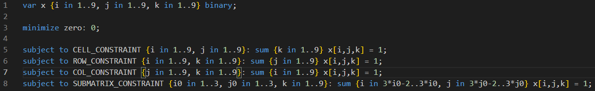
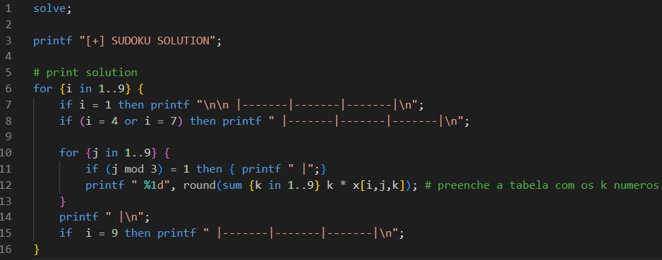
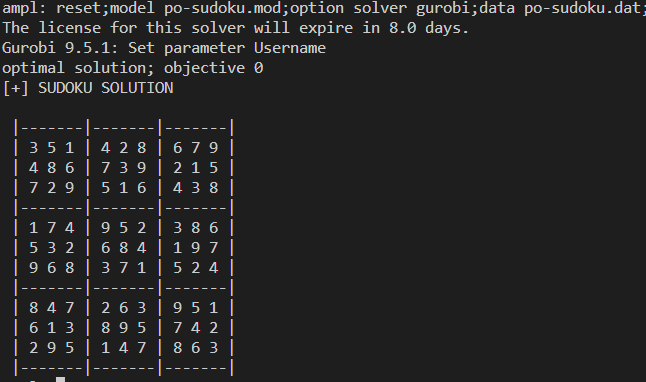

# SUDOKU - AMPL 
- Sudoku Implementation in AMPL

## Formulation
### Decision Variable
$$ x_{ijk} = 1\ if\ number\ k\ is\ in\ row\ i,\ column\ j;\ 0,\ on\ the\ contrary; $$ 

### RULE 1 - cell constraint 
$$ \sum_{k=1}^{9}x_{ijk} = 1\  for\ i\ = 1..9, j = 1..9 $$

### RULE 2 - row constraint
$$ \sum_{j=1}^{9}x_{ijk} = 1\  for\ i\ = 1..9, k = 1..9 $$

### RULE 3 - column constraint
$$ \sum_{i=1}^{9}x_{ijk} = 1\  for\ j\ = 1..9, k = 1..9 $$

### RULE 4 - submatrix constraint
$$ \sum_{3_{i0} - 2 }^{3_{i0}} \sum_{3_{j0} - 2}^{3_{j0}} x_{ijk} = 1\  for\ i_0 = 1..3, j_0 = 1..3 $$

## AMPL CODE (.mod)

[sudoku.mod](sudoku.mod)

## AMPL PRINT (.dat) 

[sudoku.dat](sudoku.dat)

## RESULT

